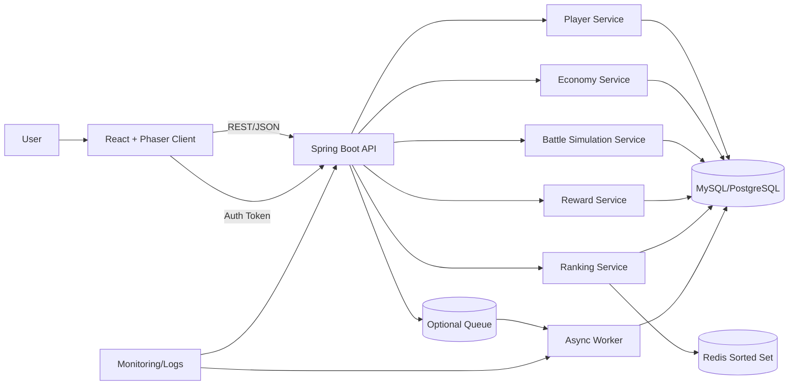

# 01. 전체 게임 아키텍처 다이어그램

## 목표
- 싱글 플레이(방치형) + PvP 시뮬레이션 + 랭킹을 분리된 컴포넌트로 운영
- 클라이언트는 렌더링/입력에 집중, 서버는 상태 계산/검증 담당

## 논리 아키텍처

## 요청 흐름
1. 클라이언트는 로그인 후 토큰 획득
2. 게임 진입 시 `player snapshot` API 호출
3. 전투/성장/보상 수령은 서버 검증 후 상태 반영
4. 랭킹 점수는 Redis에 반영, 주기적으로 DB 스냅샷

## 모듈 경계
- Client: UI, 애니메이션, 로컬 임시 캐시
- API: 입력 검증, 도메인 규칙 적용, 영속화
- Redis: 실시간 랭킹 계산
- DB: 영구 데이터 저장 및 감사 이력
