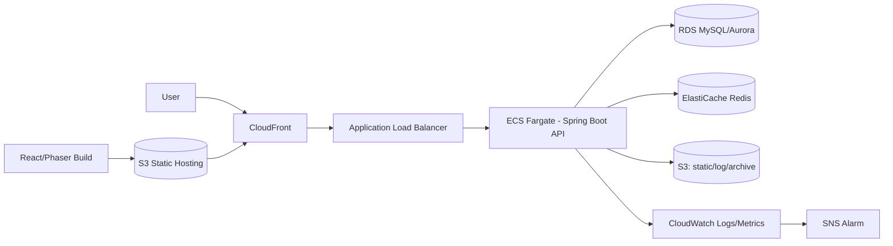

# 07. AWS 이전 구조

## 목표
- 초기 단일 인스턴스에서 시작, 트래픽 증가 시 수평 확장
- 랭킹/세션성 워크로드는 Redis로 분리

## 대상 아키텍처

## 단계별 이전
1. Phase 1: EC2 단일 서버 + RDS + Redis
2. Phase 2: ALB + Auto Scaling + Multi-AZ
3. Phase 3: ECS Fargate 전환, Blue/Green 배포

## 인프라 체크리스트
- VPC: public/private subnet 분리
- 보안: SG 최소 권한, Secrets Manager 사용
- DB: 자동 백업, PITR, 읽기 부하 시 Read Replica
- Redis: 랭킹 키 TTL/스냅샷 정책 수립
- 배포: GitHub Actions -> ECR -> ECS

## 비용 최적화
- dev/staging은 소형 인스턴스 + 스케줄 중지
- CloudWatch 로그 보관 기간 제한
- S3 lifecycle로 저비용 스토리지 이동
